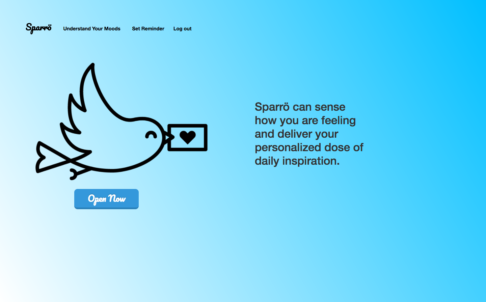
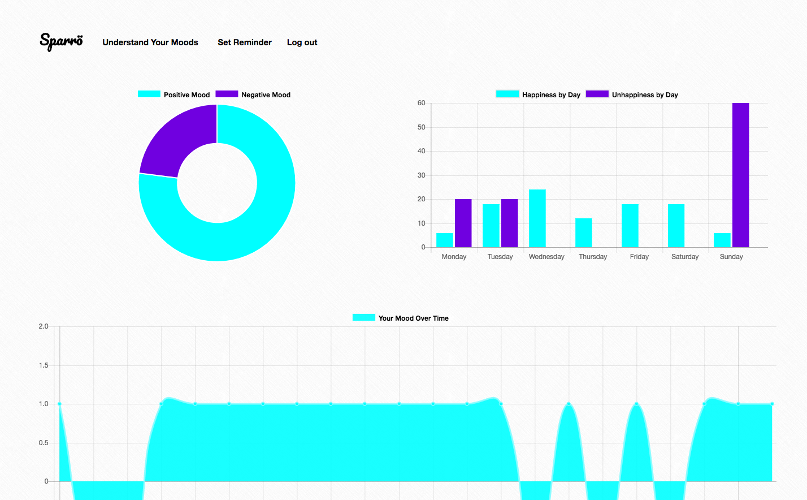
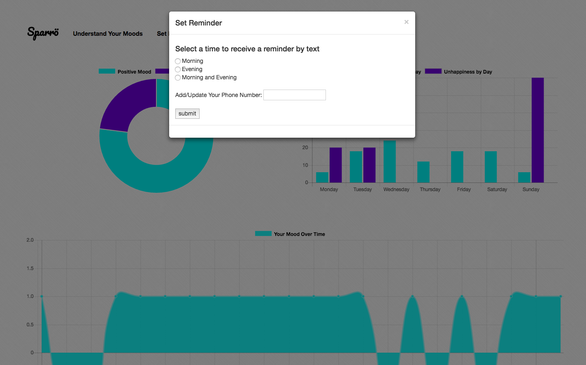

# inspirer-web-app (i.e. Sparrö)

Project:
Sparrö is a web app that serves as a means to personal empathy, self-understanding, and daily inspiration. Sparrö draws on natural language processing to conduct sentiment analysis of a user’s Twitter feed. Based on the analysis of the user’s current mood, the user receives an inspirational quote or poem suited to their attitude. The app can track the user’s attitude over time, visualize this information, and let the user set reminders via text message.

Tech Stack:
Python, JavaScript, Flask, Postgresql, SQLAlchemy, SQL, NLTK, Cron, D3.js, Typed.js, Charts.js,  jQuery, AJAX, JSON, Bootstrap

APIs:
Twitter API, Twilio API

Features:
After building my data model and seeding my PostgreSQL database,  I trained the Naïve Bayes Classifier from Python's NLTK library to understand positive and negative lablels through my supervised training data set of 600 tweets. 

A button on the main 'inspire' page serves as an event listener that triggers a series of AJAX requests, resulting in 3 callback functions that I sequenced using jQuery. The first response shows the actual tweets that are being sourced from the Twitter API, being analyzed by my classifier and labeled as positive or negative. The second response shows a D3 graph of the user’s current average positivity probability based on the tweets. The third response shows a quote from my database suited to the user's mood, which the server queried the database for, using SQLAlchemy.

The same button (event listener) records information about the transaction, such as a timestamp, the quote_id of the quote sent to the user to ensure no-repeats, and the current sentiment of the user based on the analysis. This information is recorded in my database, and then used on my 'moods' page to populate 3 graphs from the Charts.js library. 

I integrated with the Twilio API to enable the user to receive a text that their quote/poem is ready. The form is housed in a Bootstrap modal window and the information is stored in my PostgreSQL database. I used cron jobs to schedule the texts to be sent out. 

I currently have 60% testing coverage. 
